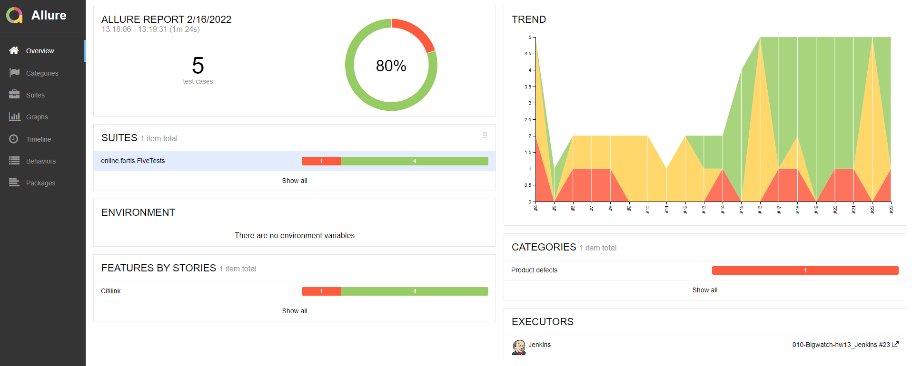

[](https://git.io/typing-svg)

<h1>:bookmark_tabs: Содержание</h1>

:eight_spoked_asterisk:	 Стек технологий

:eight_spoked_asterisk:	 Запуск тестов в Jenkins

:eight_spoked_asterisk:	 Отчет о результатах тестирования в Allure Report

:eight_spoked_asterisk:	 Уведомления в Telegram с использованием бота

:eight_spoked_asterisk:	 Пример запуска теста в Selenoid


<h2>:books:	 Стек технологий</h2>


<p>
 


 
</p>


<h2>:arrow_forward:	 Запуск тестов в Jenkins</h2>

```
clean
test
-Dbrowser=${BROWSER}
-Dversion=${VERSION}
-DremoteUrl=${REMOTEURL}
-Dlogin=${LOGIN}
-Dpassword=${PASSWORD}
```


<h2>:bar_chart:	 Отчет о результатах тестирования в Allure Report</h2>

<h3>Страница с обощёнными данными по отчёту</h3>

<p align="center">

</p>

<h3>Страница с графической информацией</h3>

<p align="center">

</p>


